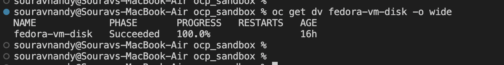
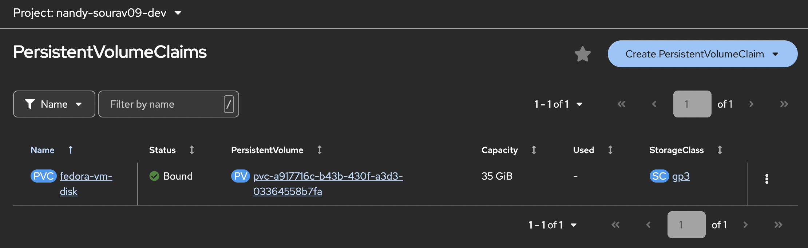
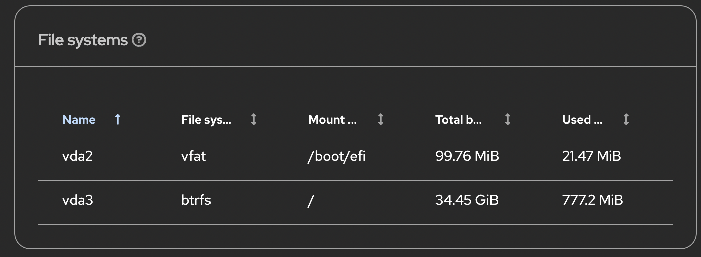

# OpenShift Virtualization — Hands-on Lab Guide

I run a production OpenShift platform for a telecom SIP based contact center. All my workloads are containers. But KubeVirt kept coming up in architecture conversations and I had zero hands-on with it. So I set up a lab on Red Hat Developer Sandbox, went end to end, hit real errors, fixed them, and documented everything here.

This is not copy pasted from docs. This is what I actually did, what broke, and what I learned.

---

## What This Covers

- How the full stack works from bare metal to a running VM
- How to provision a Fedora VM using DataVolumes and CDI
- 3 real errors I hit and exactly how I fixed them
- How VM networking works and why the IP inside the VM is different from what OCP sees
- How VM storage works with CDI, DataVolumes and PVCs

---

## The Full Stack at a Glance

One thing that confused me initially was where KVM fits in. There is no separate hypervisor installed. RHCOS goes directly on the bare metal and already has KVM built into the kernel. OpenShift runs on top of RHCOS. The OpenShift Virtualization operator adds VM capability on top of that. So the full stack looks like this:

```
HP DL380 (bare metal server)
  └── RHCOS (OS installed directly on metal, no hypervisor)
        └── OpenShift (Kubernetes running on RHCOS nodes)
              └── OpenShift Virtualization Operator (adds VM capability)
                    ├── CDI — pulls the OS image and stores it as a PVC (the VM disk)
                    ├── VirtualMachine CR — the desired state, like a Deployment
                    ├── VMI — the running VM instance, like a Pod
                    └── virt-launcher pod — the actual pod running QEMU+KVM, this IS the VM
```

Containers and VMs run side by side on the same worker nodes. The scheduler treats a virt-launcher pod the same as any other pod.

---

## VM Running on OpenShift

Once the VM is up you can see it in the OCP console under Virtualization. It shows the OS (Fedora Linux 44 Cloud Edition), CPU, memory, and the current status. The VM here is running on the same cluster that also runs regular container workloads.


From the VM details page, OCP shows everything linked together. You can see the VirtualMachineInstance name, the virt-launcher pod that is backing this VM, and the network IP assigned to it. This is useful when troubleshooting because you can jump directly from the VM to the pod.


---

## The virt-launcher Pod

Every running VM has exactly one virt-launcher pod on a worker node. This is the most important thing to understand about how KubeVirt works. Inside this pod, QEMU runs the actual VM guest OS using the KVM kernel module that is already part of RHCOS. So the VM is not running on a separate hypervisor. It is running as a process inside a pod, on the same worker node where your containers run.

The pod has KubeVirt labels that link it back to the VM and VMI. You can also see which worker node it landed on and what its pod IP is. That pod IP is what the rest of the cluster uses to reach the VM.


---

## Storage — How the VM Gets Its Disk

Before a VM can start, it needs a disk with an OS already on it. This is handled by CDI, the Containerized Data Importer. When you create a DataVolume in your VM manifest, CDI spins up an importer pod that clones the source OS image into a PVC in your namespace. That PVC becomes the VM's virtual hard disk. You do not manually create or format anything, CDI does it all.

The source images live in the openshift-virtualization-os-images namespace. These are pre-built PVCs maintained by Red Hat. You just reference which one you want in your DataVolume.



Once the DataVolume reaches Succeeded at 100% progress, the PVC is fully populated and the VM can boot from it. The PVC shows up in your namespace bound to an actual storage volume.



These are all the OS images available in the sandbox that CDI can clone from. You can see Fedora, RHEL 7, 8, 9, 10, CentOS Stream 9 and 10, and even Windows 2016, 2019, 2022, 2025, Windows 10 and 11. All of them are 30Gi PVCs on gp3 storage, ready to clone.


---

## Networking — Why the IP Looks Different Inside vs Outside

This tripped me up when I first logged into the VM. I ran ip addr inside the VM and got 10.0.2.2. But the OCP console was showing the VM IP as 10.130.0.89. Same VM, two completely different IPs.

The reason is masquerade networking. By default OpenShift Virtualization uses masquerade mode for VM networking. The VM guest OS gets an internal IP of 10.0.2.2 which is managed by QEMU inside the virt-launcher pod. When traffic goes in or out of the VM, QEMU does NAT and routes it through the virt-launcher pod's real OVN-Kubernetes IP which is 10.130.0.89. So the cluster sees 10.130.0.89 and the VM thinks it is 10.0.2.2.

If you want other pods or services to reach the VM, you create a Service with a label selector pointing to the VMI labels, same as you would for any pod. CoreDNS handles the rest.


In this screenshot you can also see lsblk showing vda as the 35G virtual disk from the PVC, and df -h confirming the filesystem is up with only 2% used out of 35G.

---

## Filesystem Inside the VM

The VM disk shows up as vda inside the guest OS. vda3 is the main root partition using btrfs filesystem with 34.45 GiB total. This partition is mounted at /, /home, /boot and /var. It maps directly to the 35Gi PVC that CDI provisioned from the Fedora DataSource.



---

## VM Console

You can access the VM directly from the OCP console via the Console tab. Login with the user and password you set in the cloudInit section of your VM manifest. Passwordless sudo works once you are in.


---

## Docs

| Doc | What it covers |
|-----|---------------|
| [01 - Architecture](docs/01-architecture.md) | Full stack explained layer by layer |
| [02 - VM Setup](docs/02-vm-setup.md) | Step by step VM creation with YAML |
| [03 - Errors and Fixes](docs/03-errors-and-fixes.md) | 3 real errors I hit and how I fixed them |
| [04 - Networking](docs/04-networking.md) | Why the VM IP looks different inside vs outside |
| [05 - Storage](docs/05-storage.md) | How CDI, DataVolumes and PVCs work together |

---

## Manifests

| File | What it is |
|------|-----------|
| [vm.yaml](manifests/vm.yaml) | VirtualMachine with cloudInit and DataVolume |
| [datavolume.yaml](manifests/datavolume.yaml) | Standalone DataVolume from Fedora DataSource |

---

## Prerequisites

- Red Hat Developer Sandbox account (free at developers.redhat.com)
- oc CLI installed and logged in
- OpenShift Virtualization already enabled in the sandbox

---

## What I Still Want to Explore

- Live migration with RWX storage using ODF and Ceph
- MTV for migrating VMware VMs into OCP
- SR-IOV for high performance VM networking

---

## Author

Sourav Nandy — Solutions Architect, Platform and DevOps Engineer
[LinkedIn](https://linkedin.com/in/sourav-nandy) | [GitHub](https://github.com/sourav-ndx)
