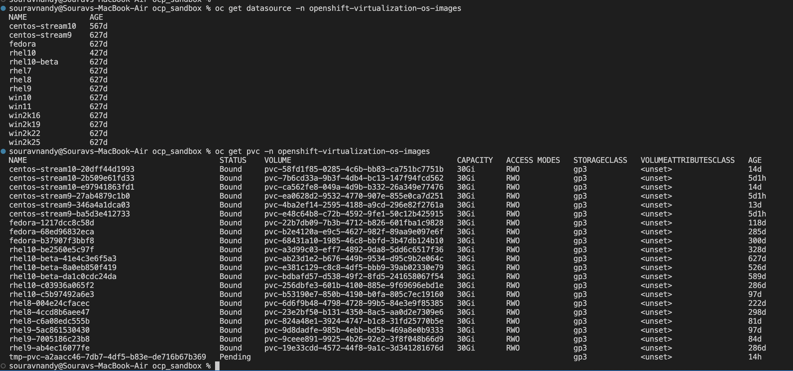
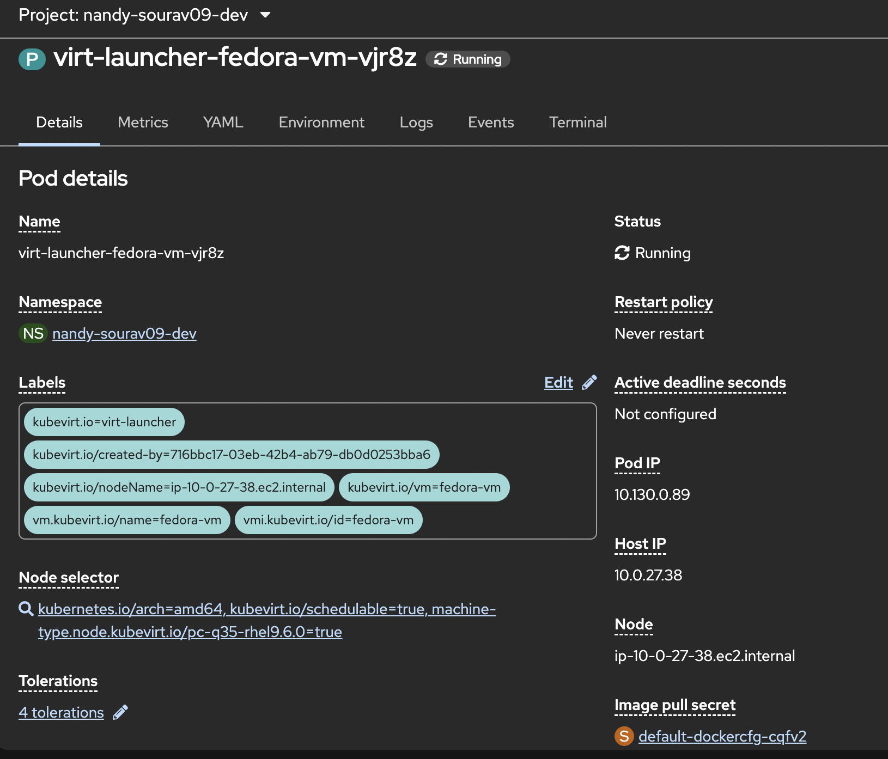

# Architecture — How the Full Stack Works

A lot of people think OpenShift Virtualization means there is a hypervisor sitting somewhere under OpenShift. There is not. Here is how it actually works, layer by layer.

---

## Layer 1 — Bare Metal (HP DL380)

This is the physical server. It has CPU, RAM, and local disks. Nothing is installed on it yet. No VMware, no KVM, no hypervisor of any kind. Just raw hardware.

---

## Layer 2 — RHCOS (Red Hat CoreOS)

RHCOS is installed directly on the bare metal. It is an immutable, container optimized OS. You do not SSH in and configure it manually. Changes to nodes happen through the Machine Config Operator (MCO) which applies configs and reboots nodes in a controlled way.

One important thing: RHCOS already has the KVM kernel module built in. You do not install KVM separately. It is already there inside the OS kernel, waiting to be used.

---

## Layer 3 — OpenShift

OpenShift is a Kubernetes distribution that runs on top of RHCOS across a set of nodes. You have control plane nodes that manage the cluster and worker nodes where your workloads run. Everything you know about Kubernetes applies here — pods, deployments, services, namespaces, RBAC, etc.

---

## Layer 4 — OpenShift Virtualization Operator (CNV)

This is installed on top of OpenShift using OLM (Operator Lifecycle Manager). Once installed, it adds VM capability to the cluster. It brings in:

- KubeVirt CRDs (VirtualMachine, VirtualMachineInstance, etc.)
- CDI (Containerized Data Importer) for handling VM disk images
- The virt-launcher runtime that actually runs VMs as pods

After this is installed, your worker nodes can run both containers and VMs at the same time.

---

## Layer 5 — CDI (Containerized Data Importer)

Before a VM can start, it needs a disk with an OS on it. CDI handles this. When you create a DataVolume pointing at a source image (like the Fedora image in the openshift-virtualization-os-images namespace), CDI spins up an importer pod, clones the source image, and stores it into a PVC. That PVC becomes the VM's virtual hard disk.

Think of it like this: CDI is the thing that takes the OS image and copies it onto a virtual disk so your VM has something to boot from.


*The openshift-virtualization-os-images namespace has pre-built PVCs for Fedora, RHEL 7/8/9/10, CentOS, and even Windows. CDI clones from these when you create a VM.*

---

## Layer 6 — VirtualMachine (CR)

This is the YAML object you create. It defines what you want: how much CPU, how much memory, which disk, which network, and when to start. Think of it like a Deployment object but for VMs. It holds the desired state.

---

## Layer 7 — VirtualMachineInstance (VMI)

When the VM starts, a VMI object gets created automatically. This is the running instance of the VM. Same relationship as Deployment to Pod — VirtualMachine is the desired state, VMI is what is actually running.

---

## Layer 8 — virt-launcher Pod

This is the most important thing to understand. Every running VM has exactly one virt-launcher pod on a worker node. Inside that pod, QEMU runs the actual VM using the KVM kernel module. So the VM guest OS, your Fedora Linux in this case, is running inside QEMU, inside a pod, on a worker node.

From OpenShift's perspective, the VM is just a pod. The scheduler treats it like any other pod. It gets an IP from OVN-Kubernetes just like a regular pod.


*The virt-launcher pod running on worker node ip-10-0-27-38.ec2.internal with all KubeVirt labels.*

---

## The Full Picture

```
VirtualMachine CR (desired state, like a Deployment)
  └── VMI (running instance, like a Pod)
        └── virt-launcher pod (actual pod on the worker node)
              └── QEMU process using KVM (the VM guest OS runs here)
                    └── PVC from DataVolume (the VM's disk)
```

Containers and VMs run side by side on the same worker nodes. The Kubernetes scheduler decides where each virt-launcher pod goes, same as it does for any other pod.
