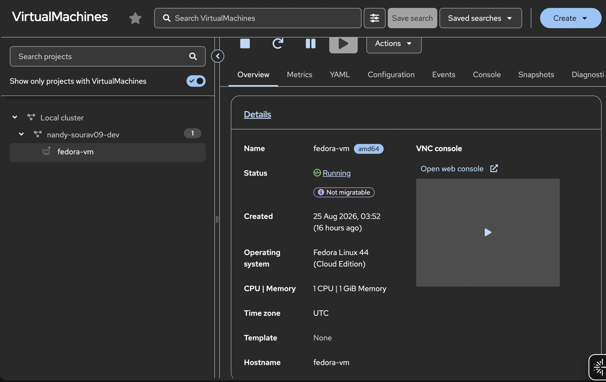
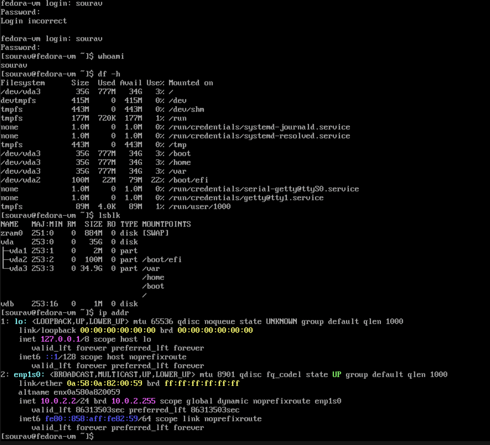

# VM Setup — Step by Step

This is exactly how I set up the Fedora VM on Red Hat Developer Sandbox.

---

## Prerequisites

- Red Hat Developer Sandbox account
- oc CLI installed and logged in via token
- OpenShift Virtualization enabled in your sandbox namespace

---

## Step 1 — Check What OS Images Are Available

The openshift-virtualization-os-images namespace has pre-built disk images for different operating systems. CDI will clone from one of these when you create your VM.

```bash
oc get datasource -n openshift-virtualization-os-images
```

You will see Fedora, RHEL versions, CentOS, and even Windows options. We will use Fedora.

---

## Step 2 — Apply the VM Manifest

```bash
oc apply -f manifests/vm.yaml
```

See [vm.yaml](../manifests/vm.yaml) for the full manifest. The important parts are the DataVolume template (which tells CDI to clone the Fedora image), the cloudInit section (which sets up the user account), and the runStrategy.

---

## Step 3 — Watch the DataVolume Get Populated

```bash
oc get datavolume -w
```

Wait until you see PHASE as Succeeded and PROGRESS as 100%. This is CDI cloning the Fedora image into your PVC. It takes a few minutes.

```
NAME             PHASE       PROGRESS   RESTARTS   AGE
fedora-vm-disk   Succeeded   100.0%                16h
```

---

## Step 4 — Start the VM

In Developer Sandbox, use the web console to start the VM:

```
Virtualization → VirtualMachines → fedora-vm → Actions → Start
```

In a regular OCP cluster you can also use:
```bash
virtctl start fedora-vm
```

Note: In the sandbox, CLI start is blocked by a webhook. The console bypasses this. See [errors doc](03-errors-and-fixes.md) for full details on why.


*fedora-vm showing Running status in the OCP console. OS is Fedora Linux 44 Cloud Edition, created on 25 Aug 2026.*

---

## Step 5 — Verify Everything is Up

```bash
oc get vm
oc get vmi
oc get pods | grep virt-launcher
oc get dv
oc get pvc
```

You should see the VM running, the VMI created, the virt-launcher pod running, and the PVC bound.


*OCP shows the VMI, the virt-launcher pod name, and the VM's network IP all linked together.*

---

## Step 6 — Log into the VM

Go to: Virtualization → VirtualMachines → fedora-vm → Console tab

Log in with the user and password you set in cloudInit.

```bash
whoami      # sourav
df -h       # shows vda3 35G disk from the PVC
lsblk       # shows the disk layout
ip addr     # shows internal masquerade IP 10.0.2.2
```


*Logged into the VM. vda3 shows the 35G disk provisioned by CDI. ip addr shows the internal masquerade IP 10.0.2.2.*

The IP you see inside the VM (10.0.2.2) is different from what OCP shows (10.130.0.89). This is expected. See [04-networking.md](04-networking.md) for why.
