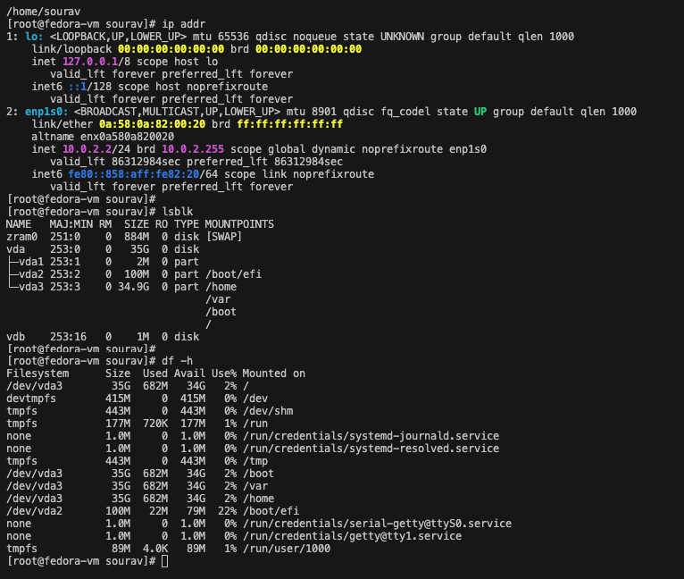
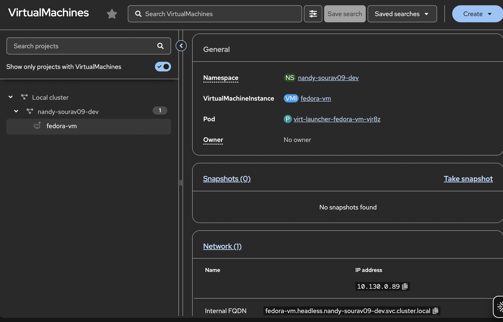

# VM Networking — Why the IP Looks Different Inside vs Outside

This confused me at first. When I ran ip addr inside the VM, I got 10.0.2.2. But when I checked the OCP console, it showed the VM IP as 10.130.0.89. Same VM, two different IPs. Here is why.

---

## What You See Inside the VM


*Inside the VM: ip addr shows 10.0.2.2 on enp1s0. lsblk shows vda (35G disk from PVC). df -h shows the filesystem usage. Logged in as root via sudo.*

```
2: enp1s0
    inet 10.0.2.2/24
```

That 10.0.2.2 is the internal masquerade IP. The VM guest OS thinks this is its real IP. It is not what the cluster sees.

---

## What OCP Sees


*OCP console shows the VM IP as 10.130.0.89, which is actually the virt-launcher pod's IP on the OVN network.*

---

## Why They Are Different

OpenShift Virtualization uses masquerade networking by default. Here is what that means:

The VM guest OS thinks its IP is 10.0.2.2. This is an internal IP managed by QEMU inside the virt-launcher pod. When traffic goes in or out of the VM, QEMU does NAT (Network Address Translation) and routes it through the virt-launcher pod's real IP, which is 10.130.0.89 on the OVN-Kubernetes network.

So from the cluster's point of view, the VM is just another pod sitting at 10.130.0.89. The internal 10.0.2.2 is invisible to everything outside the pod.

---

## The Full Networking Stack

```
VM guest OS (sees 10.0.2.2 internally)
  └── QEMU masquerade NAT (translates traffic in and out)
        └── virt-launcher pod (real IP 10.130.0.89 on OVN network)
              └── OVN-Kubernetes (assigns pod IPs, handles routing)
                    └── Multus (meta-CNI, can attach multiple NICs to a VM)
                          └── Node network
```

---

## How Other Pods Connect to a VM

You create a Service pointing at the VM, same way you would for any pod. The trick is to use the VMI labels in the selector:

```yaml
apiVersion: v1
kind: Service
metadata:
  name: fedora-vm-service
spec:
  selector:
    kubevirt.io/domain: fedora-vm
  ports:
    - port: 22
      targetPort: 22
```

Other pods can then reach the VM at fedora-vm-service:22 via CoreDNS. The VM gets treated exactly like a pod from a networking perspective.

---

## What About Multus?

Multus is a meta-CNI plugin that lets you attach multiple network interfaces to a pod or a VM. In my production SIP platform, we use Multus to give pods a secondary NIC on a dedicated media network so SIP audio traffic is isolated from the main application network. The same concept applies to VMs in OpenShift Virtualization. If a VM needs direct access to a specific network, you attach a secondary interface via a NetworkAttachmentDefinition.
